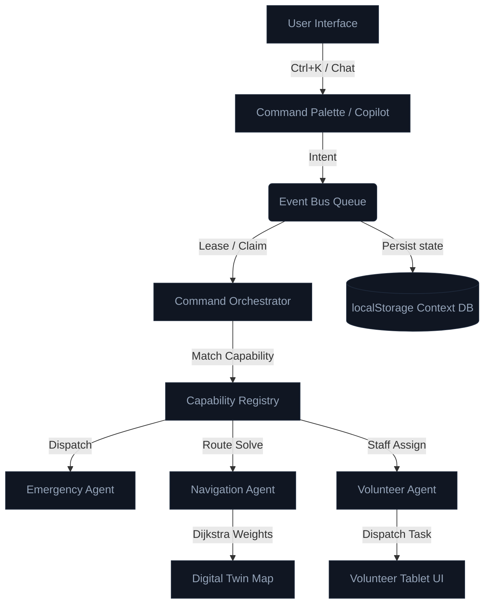
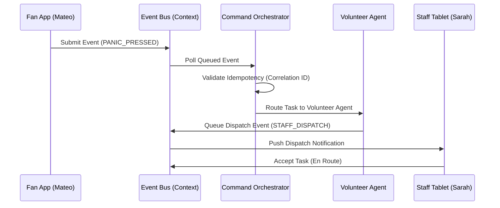

# Spec: FIFA World Cup 2026 Smart Stadium Operating System Overhaul (Expanded Edition)

## 📋 1. Overview
This specification details the comprehensive, production-grade enhancements to upgrade **Stadium OS** into a state-of-the-art AI platform suitable for a FIFA World Cup Operations Command Center. The system will represent a flagship integration of multi-agent intelligence, visual Digital Twin telemetries, voice navigation, predictive analytics, and executive EOC cockpit dashboards, while preserving all existing architecture, layouts, routing, and styling.

---

## 🎨 2. Expanded Design Specifications

### 2.1 AI Explainability Engine
* **Decision Versioning**: Each routing calculation or dispatch recommendation will carry a version key (e.g. `v1.0.4-ROUTE`) incremented whenever graph conditions or crowd densities shift.
* **Confidence Breakdown**: Detail the confidence percentage into sub-factors:
  * *Navigation Confidence* (based on node reachability: e.g., `99.2%`)
  * *Crowd Flow Safety Confidence* (based on queue wait times: e.g., `95.4%`)
  * *Accessibility Compliance* (step-free ramp validation: e.g., `100.0%`)
  * *Emergency Asset Priority* (AED/medical proximity: e.g., `98.7%`)
* **Alternative Routes Comparison**: Display up to 2 alternative paths in the chat bubble or sidebar:
  * *Route A (Fastest via Gate A)*: Rejected due to "Gate A Queue exceeds 25 minutes".
  * *Route B (Step-Free via Sector 102)*: Rejected due to "Staircase access only".
* **AI Trust Score**: Real-time reliability metric calculated from successful historical resolutions vs. retries (e.g., `98.9%`).
* **Decision Impact Metrics**: Displays the concrete benefits of the recommendation:
  * `ETA Saved`: e.g., `12 minutes saved`
  * `Congestion Reduced`: e.g., `4.2% lower load on Gate A`

### 2.2 Agent Telemetry & Processing Pipelines
* **Agent Health Score**: Standardized 0-100 score based on latency limits and event failures.
* **CPU and Memory Simulation**: Dynamic CPU load (e.g. `12%` - `45%`) and memory allocations (e.g. `120MB` - `180MB`) rendering simulated activity spikes when processing events.
* **Event Throughput**: Active events/min ticker.
* **Last Heartbeat**: Relative time display (e.g. `1s ago`, `active`).
* **Queue Depth History**: A mini sparkline rendering the historical event queue size.
* **Live Event Stream**: Live updating, scrolling terminal-like pipeline view showing exact step-by-step agent executions.
* **Processing Pipeline Visualization**: Visual flowchart in the Command page showing state transitions (Queued ➔ Leased ➔ Processing ➔ Completed).

### 2.3 Interactive Digital Twin Enhancements
* **Crowd Flow Animation**: Small animating dot clusters near the gates showing flow direction.
* **Volunteer Movement Animation**: Dynamic translation transitions on SVG coordinate dots when volunteers are dispatched to incidents.
* **Vehicle Movement**: Simulated shuttle transit buses moving along transit tracks.
* **Heatmap Overlays**: Toggleable color overlay showing crowd densities (Green: low, Amber: medium, Red: critical).
* **Dynamic Congestion Zones**: Interactive pulsing circles overlaying congested gates (e.g. Gate A).
* **Layer Toggle System**: Checkboxes to toggle map layers (Incidents, Crowd Density, AED/Medical, Volunteers, Shuttles).
* **Timeline Replay Mode**: Scrubbing control to playback past incident event sequences.

### 2.4 Command Center Cockpit (EOC)
* **Global Command Palette (Ctrl+K)**: Centered dark glass backdrop modal supporting fast search and command executions (e.g. `Toggle Heatmaps`, `Sound Alarm`, `Reset Demo`).
* **Keyboard Shortcuts**: Key bindings documented inside settings (e.g. `Esc` to close modals, `Space` to pause replay).
* **Activity Timeline & Command History**: Complete listing of administrator actions and recent search queries.
* **Report Exports**: Instant client-side download of CSV/JSON reports containing:
  * Active incidents and volunteer dispatches
  * Event queue processing times and DLQ audit traces
  * Live sustainability metrics

### 2.5 Voice-Enabled AI Copilot
* **Multilingual Voice Input**: Speech-to-text button utilizing browser SpeechRecognition supporting English and Spanish.
* **Multilingual Voice Output**: SpeechSynthesis readout of Copilot responses.
* **Suggested Prompt Chips**: Clickable context chips (e.g., `"Restroom step-free route"`, `"Check peanut-free burgers"`, `"NJ Transit schedule"`).
* **Word-by-Word Streaming**: Simulates token-by-token streaming inference speed.

### 2.6 Predictive Intelligence
* **Crowd Density Forecast**: Live predictions of gate occupancy over the next 60 minutes.
* **Emergency Risk Index**: Calculated from crowd bottlenecks and active medical distress locations.
* **Weather Impact Predictor**: Adjusts graph weights (e.g. rain biases paths to covered concourse corridors).

### 2.7 Executive Dashboard Indicators
* Stadium Health Index (overall EOC score).
* Sustainability Score (energy diversion, water usage).
* Volunteer response times leaderboard.

---

## 🛠️ 3. Engineering Quality & Architecture

### 3.1 Swarm Architecture Diagram



### 3.2 Sequence Diagram: Panic Button Alarm Dispatch



---

## 📂 4. Project Directory Structure
```
ArenaPilot/
├── e2e/                           # Playwright E2E integration specs
├── src/
│   ├── __tests__/                 # Jest test suites
│   ├── agents/                    # Multi-agent logic (navigation, translation, copilot)
│   ├── app/                       # Next.js App Router entry points (simulator, command, etc.)
│   ├── components/                # Modular visual UI dashboard components
│   ├── context/                   # StadiumOS Context provider and storage synchronizer
│   ├── hooks/                     # Custom React hooks (useAgentMetrics, useLocalClock)
│   ├── services/                  # Business logic (stadiumService, incidentService)
│   ├── types/                     # Consolidated TypeScript interfaces
│   └── utils/                     # Translation helper dictionaries
```

---

## 🧪 5. Testing & Compliance Checklist

### 5.1 Test Strategy
* **Unit Tests (Jest)**: Mock SpeechSynthesis API inputs, verify Dijkstra mode-based rerouting, test event bus queue retry logic.
* **E2E Tests (Playwright)**: Test global search, simulation actions (lost child / panic button), and role tab selection workflows.

### 5.2 Accessibility (WCAG AA+)
* Keyboard navigation: Ensure `tabIndex` focus management and action triggering on all interactive elements.
* Screen reader: Explicit `aria-label`, `aria-live` regions for live ticker logs, and skip-to-content links.
* Contrast ratio: Ensure text meets the minimum 4.5:1 ratio against dark backgrounds.
